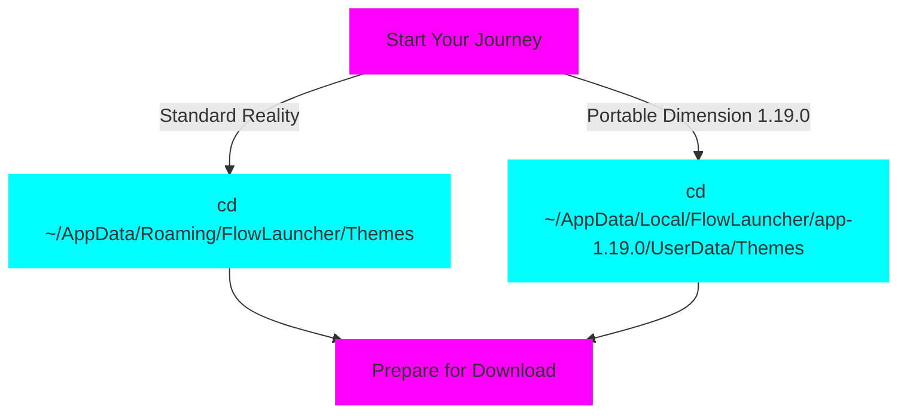

# 🌴🌆 RetroWave & RetroWave1984 Themes for Flow Launcher 🚀🕹️

Neon-infused themes for Flow Launcher with vibrant retro colors, bringing a touch of 80s nostalgia to your desktop!

## 🖼️ Theme Previews

Get ready to travel back in time with these electrifying themes!

### 🌅 RetroWave

<p align="center">
  
</p>

### 🌃 RetroWave1984

<p align="center">
  
</p>

## 🔍 Problem Statement

Many users find default launcher themes bland and uninspiring. There's a need for visually striking, customizable themes that enhance the user experience without compromising functionality.

## 🎯 Solution

RetroWave and RetroWave1984 themes offer a unique, retro-futuristic aesthetic for Flow Launcher, combining functionality with a visually appealing interface inspired by 80s design trends.

## 🌟 Key Features

- 🌑 Dark background with neon accents
- 🎨 Bright 80s-style color palette
- 🖥️ Futuristic interface design
- 🔄 Easy installation and application
- 🧩 Compatible with Flow Launcher's functionality

## 🛠️ Installation: Journey to the Retro Future

<div align="center">
  
</div>

Welcome, time traveler! 🕰️ Are you ready to transform your Flow Launcher into a portal to the 80s? Follow our neon-lit path to installation success!

<details>
<summary>🚀 Click to begin your RetroWave journey</summary>

### Step 1: Choose Your Dimension 🌠

<div align="center">
  
</div>



### Step 2: Summon the RetroWave Files 📡

Choose your cosmic download tool:

<div align="center">

| 🛠️ Arcane Tool | 🌈 Incantation |
|:---------------:|:---------------|
|  | <code>curl -Uri "https://raw.githubusercontent.com/ruslanlap/RetroWaveTheme.FlowLa/master/RetroWave.xaml" -OutFile "RetroWave.xaml"<br>curl -Uri "https://raw.githubusercontent.com/ruslanlap/RetroWaveTheme.FlowLa/master/RetroWave1984.xaml" -OutFile "RetroWave1984.xaml"</code> |
|  | <code>curl -L -o "RetroWave.xaml" "https://raw.githubusercontent.com/ruslanlap/RetroWaveTheme.FlowLa/master/RetroWave.xaml"<br>curl -L -o "RetroWave1984.xaml" "https://raw.githubusercontent.com/ruslanlap/RetroWaveTheme.FlowLa/master/RetroWave1984.xaml"</code> |
|  | <code>wget -O RetroWave.xaml https://raw.githubusercontent.com/ruslanlap/RetroWaveTheme.FlowLa/master/RetroWave.xaml<br>wget -O RetroWave1984.xaml https://raw.githubusercontent.com/ruslanlap/RetroWaveTheme.FlowLa/master/RetroWave1984.xaml</code> |

</div>

### Step 3: Activate the Retro Portal 🌈

1. Launch your Flow Launcher
2. Navigate to the mystical Settings realm
3. Seek the Theme sanctuary
4. Choose your destiny: RetroWave or RetroWave1984
5. Witness the transformation! 🎆

<div align="center">
  
</div>

</details>

<div align="center">
  
  **Congratulations, you've successfully traveled back to the future!** 🏙️
  
  [🐦 Tweet Your Retro Setup](https://twitter.com/intent/tweet?text=Just%20installed%20the%20awesome%20RetroWave%20theme%20for%20Flow%20Launcher!%20%F0%9F%8C%86%20Check%20it%20out%3A%20https%3A%2F%2Fgithub.com%2Fruslanlap%2FRetroWaveTheme.FlowLa)
  
  [🌟 Star This Repository](https://github.com/ruslanlap/RetroWaveTheme.FlowLa)
  
</div>

## 💻 Usage for Developers

To implement the theme in your WPF application:

```xml
<Application.Resources>
    <ResourceDictionary>
        <ResourceDictionary.MergedDictionaries>
            <ResourceDictionary Source="pack://application:,,,/Themes/RetroWave.xaml"/>
            <!-- Or -->
            <ResourceDictionary Source="pack://application:,,,/Themes/RetroWave1984.xaml"/>
        </ResourceDictionary.MergedDictionaries>
    </ResourceDictionary>
</Application.Resources>
```

## 📜 License

This project is licensed under the [MIT License](https://github.com/ruslanlap/RetroWaveTheme.FlowLa/blob/master/LICENSE).

## 🔗 Additional Resources

| Resource | Description | Link |
|----------|-------------|------|
| 🚀 Flow Launcher | Official Website | [🔗 Visit](https://www.flowlauncher.com/) |
| 🌊 RetroWave Theme | Raw XAML File | [🔗 View](https://raw.githubusercontent.com/ruslanlap/RetroWaveTheme.FlowLa/master/RetroWave.xaml) |
| 🌆 RetroWave1984 Theme | Raw XAML File | [🔗 View](https://raw.githubusercontent.com/ruslanlap/RetroWaveTheme.FlowLa/master/RetroWave1984.xaml) |
| 🌙 Palenight Theme | Raw XAML File | [🔗 View](https://raw.githubusercontent.com/ruslanlap/RetroWaveTheme.FlowLa/master/Palenight.xaml) |
| 📁 GitHub Repository | Source Code | [🔗 Explore](https://github.com/ruslanlap/RetroWaveTheme.FlowLa) |
| 🐛 Issue Tracker | Report Bugs | [🔗 Report](https://github.com/ruslanlap/RetroWaveTheme.FlowLa/issues) |
| 📄 License | MIT License | [🔗 Read](https://github.com/ruslanlap/RetroWaveTheme.FlowLa/blob/master/LICENSE) |

## 🤝 Contributing

Contributions are welcome! Please feel free to submit a Pull Request.

## 🙏 Acknowledgments

- Flow Launcher community for their support and feedback
- 80s design enthusiasts for inspiration

## 🐛 Known Issues

- None currently reported. If you encounter any issues, please [report them here](https://github.com/ruslanlap/RetroWaveTheme.FlowLa/issues).

---

Last updated: October 20, 2024  
Version: 1.0.0

For the latest updates and information, please check the [GitHub repository](https://github.com/ruslanlap/RetroWaveTheme.FlowLa).
